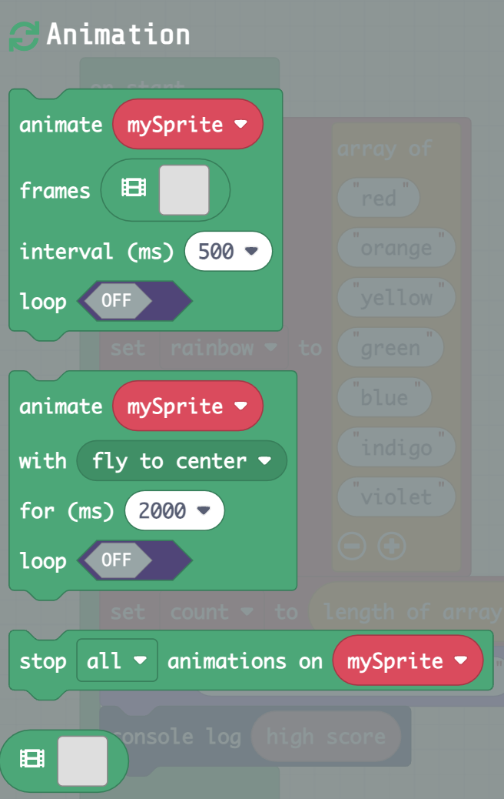
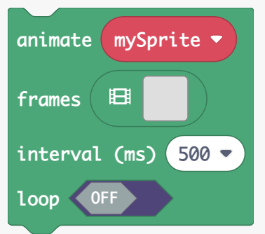
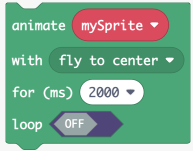
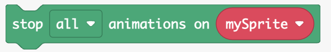

# Animation Blocks

Run Animation Image  
This block runs an animation of frames from an array of images in a
sprite.

>  style="width:2.625in;height:2.31944in"
> alt="A green rectangular object with white text Description automatically generated" />

-   For information and examples, go to
    <https://arcade.makecode.com/reference/animation/run-image-animation>

### Run Movement Animation

This block applies a movement animation effect to a sprite.

>  style="width:2.68056in;height:2.09722in"
> alt="A screenshot of a computer program Description automatically generated" />

-   For information and examples, go to
    <https://arcade.makecode.com/reference/animation/run-movement-animation>

### Stop Animation

This block stops an animation from running on a sprite.

-   For information and examples, go to
    <https://arcade.makecode.com/reference/animation/stop-animation>

