# Array Folder

An array is a list of items that are numbers, booleans, or strings.
Arrays have a length which is the number of items they contain. You get
and change the values of items at different places in an array. You find
items in an array by knowing their positions.

Checkout the Array Tutorial at
<https://makecode.microbit.org/types/array>

## Create Array

-   For more information and examples, go to
    <https://arcade.makecode.com/reference/arrays/create>

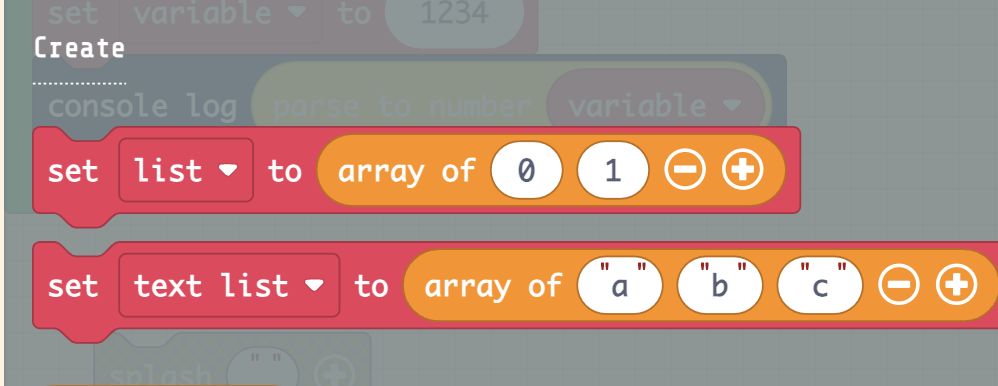

## Read Array Blocks

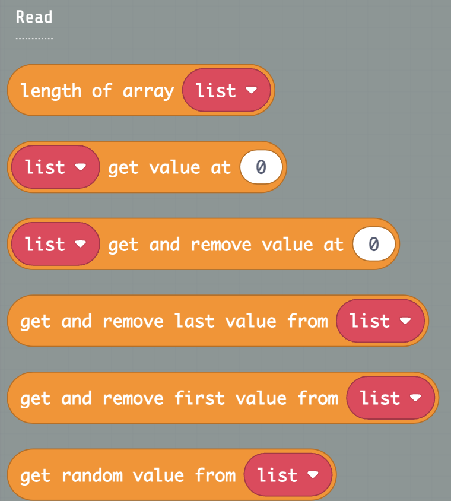

### Length of array Block

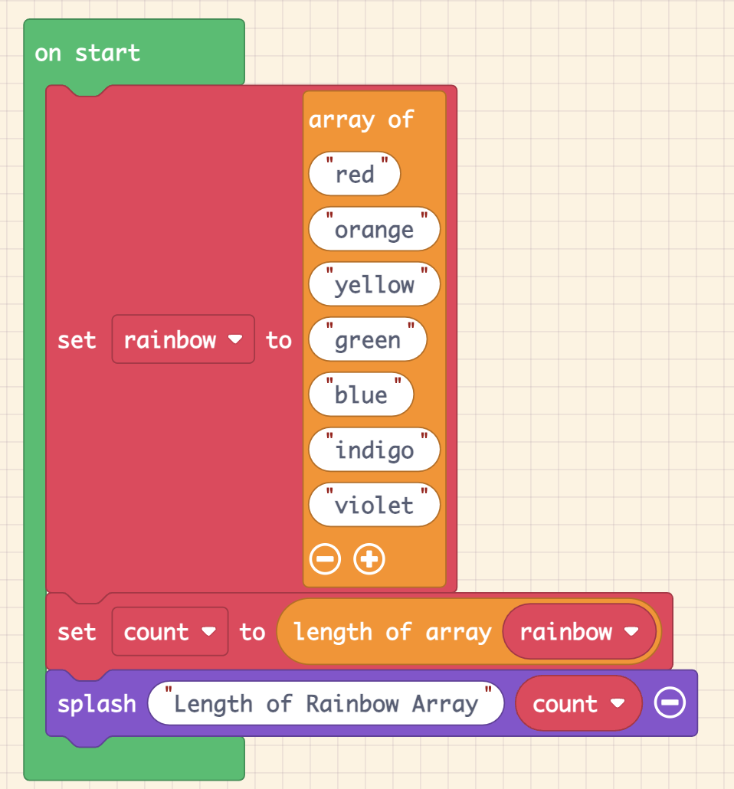

For the Make Code for the above example, go to
<https://arcade.makecode.com/S58141-60138-57098-64324>

For more information, go to
<https://arcade.makecode.com/reference/arrays/length>

### Get Value at

This block gets a value from an array at a particular index location.

-   For more information and examples, go to
    <https://arcade.makecode.com/reference/arrays/get>

 

### Get value and remove at 

This block removes an element from an array from the **at** position.

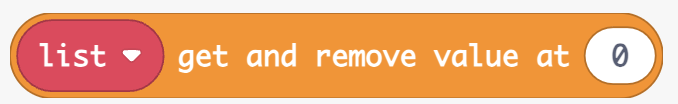

For more information and examples, go to
<https://arcade.makecode.com/reference/arrays/remove-at>

 

### Get and remove last value from (Pop)

This block retrieves and removes the last value from the array.

-   For more information and examples, go to
    <https://arcade.makecode.com/reference/arrays/pop>

### Get and remove first value from (Shift)

Remove and return the first element from an array.

-   For more information and examples, go to
    <https://arcade.makecode.com/reference/arrays/shift>

### Get random value from (Pick Random)

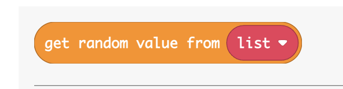

-   For more information and examples, go to
    <https://arcade.makecode.com/reference/arrays/pick-random>

## Modify Array Blocks

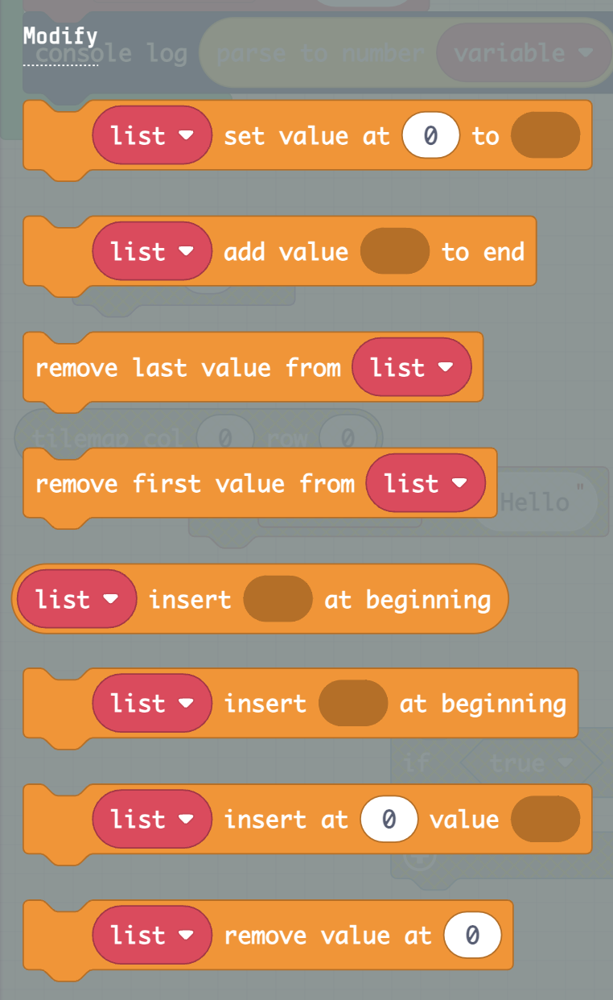

### Array Set value at (Set)

This block stores a value at an index position in the array.

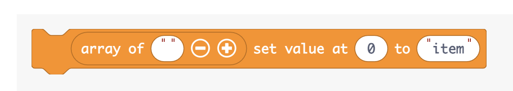

-   For more information and examples, go to
    <https://arcade.makecode.com/reference/arrays/set>

### Push Block - Array add value at end (Push)

Adds a value at the end of an array.

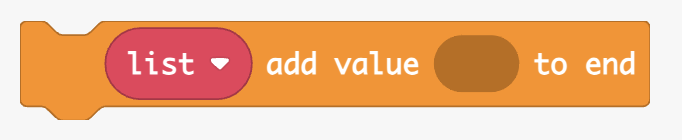

-   For more information and examples, go to
    <https://arcade.makecode.com/reference/arrays/push>

### Get and Remove last value from list (Pop) 

This block removes and returns the last element from an array.

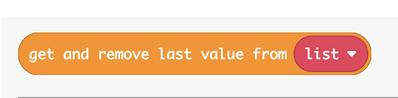

-   For more information and examples, go to
    <https://arcade.makecode.com/reference/arrays/pop>

### Get and Remove first value from list (Shift)

This block removes and returns the first element from an array.

-   For more information and examples, go to
    <https://arcade.makecode.com/reference/arrays/shift>

### Insert at beginning (Unshift)

This block adds an element to the front of an array.  
  
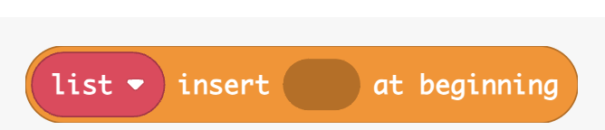

-   For more information and examples, go to
    <https://arcade.makecode.com/reference/arrays/unshift>

### Insert at 

This block inserts an element into an array at some position.

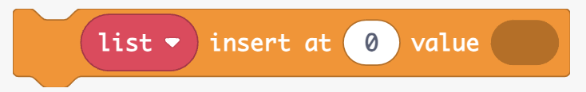

-   For more information and examples, go to
    <https://arcade.makecode.com/reference/arrays/insert-at>

### Remove at 

Remove an element from an array at some position.

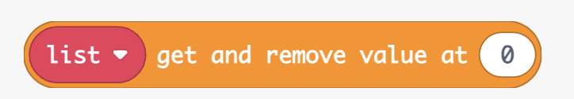

For more information and examples, go to
<https://arcade.makecode.com/reference/arrays/remove-at>

## Array Operations

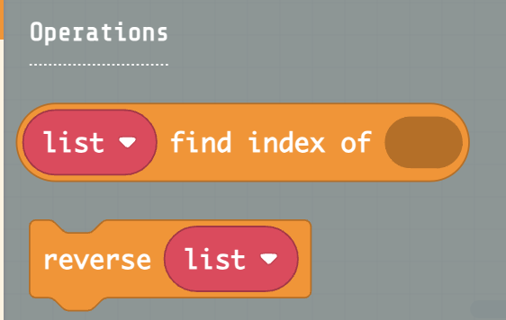

#### Array index of 

This block is used to get the index (position) of the first element in
the array that matches a search item.

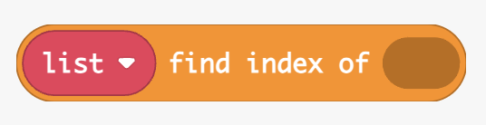

-   For more information and examples, go to
    <https://arcade.makecode.com/reference/arrays/index-of>

### Reverse Array 

This block reverses all the elements in an array.

-   For more information and examples, go to
    <https://arcade.makecode.com/reference/arrays/reverse>

-   To play with creating and resversing an Array, go to this lab
    <https://arcade.makecode.com/S58141-60138-57098-64324>