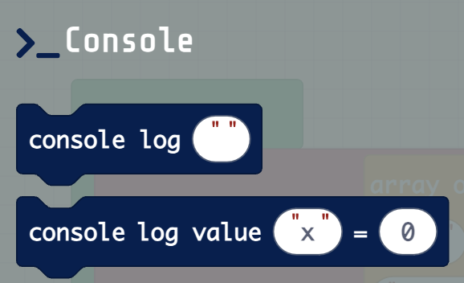
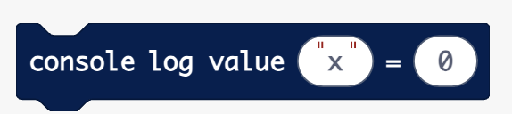

# Console Folder

For more information, go to
<https://arcade.makecode.com/reference/console/>

### Console Log 

This block writes a line of text to the console output.

-   For more information and examples, go to
    <https://arcade.makecode.com/reference/console/log>

### Console Log Value

This block write the name and the value provided.

-   For more information and examples, go to
    <https://arcade.makecode.com/reference/console/log-value>
