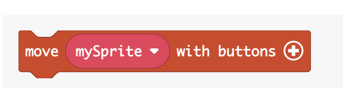

# Controller Folder

The blocks in the controller folder are used to respond a player’s
keyboard instructions.

>  style="width:4.32926in;height:2.92583in"
> alt="A screenshot of a computer Description automatically generated" />

For more information and examples, go to
<https://arcade.makecode.com/reference/controller>

## Move Sprite

The move block controls the motion of a sprite with the direction
buttons.

>  style="width:4.97601in;height:0.52293in"
> alt="A red and white rectangular button with white text Description automatically generated" />

-   For more information and examples, go to
    <https://arcade.makecode.com/reference/controller/move-sprite>

## onEvent – on button pressed

Run some code when a button is pressed or released.

>  style="width:3.95251in;height:0.79524in"
> alt="A red and white button Description automatically generated" />

-   For more information and examples, go to
    <https://arcade.makecode.com/reference/controller/button/on-event>

## is button pressed

The purpose of this block is to check if a button is pressed or not.

>  style="width:3.9298in;height:0.76282in"
> alt="A red and white button Description automatically generated" />

This block should be used in a condition in a logic block.

>  style="width:6.5in;height:1.71111in"
> alt="A screenshot of a computer game Description automatically generated" />

-   For more information and examples, go to
    <https://arcade.makecode.com/reference/controller/button/is-pressed>

##  dx Block

The ***dx*** block gets the number of horizontal movement from the right
and/or left button every time the button is pressed.

-   For more information and examples, go to
    <https://arcade.makecode.com/reference/controller/dx>

## dy Block

The ***dy*** block gets the number of vertical movement if the ***up or
down*** button is pressed.

-   For more information and examples, go to
    <https://arcade.makecode.com/reference/controller/dy>