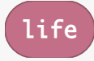

# Info Folder

## Info Score Blocks

### Score Block Variable

This block retrieves the current game score for the player. This is a
variable created by Make Code.

>  style="width:0.98611in;height:0.47222in" />

-   For information and examples, go to
    <https://arcade.makecode.com/reference/info/score>

### High Score

This block gets the highest score for the game. This is a variable
created by Make Code.

-   For information and examples, go to
    <https://arcade.makecode.com/reference/info/high-score>

### Set Score Variable

For information and examples, go to

### Change Score Variable

For information and examples, go to

### On Score Block

For information and examples, go to

## Info Life Blocks

### Life Variable

This block is used to get the game player’s ***life*** count.

-   For information and examples, go to
    https://arcade.makecode.com/reference/info/life

### Set Life Block 

This block is used set the player ***life count*** to this amount.

-   For information and examples, go to
    <https://arcade.makecode.com/reference/info/set-life>

### Change Life Block

This block allows the change the ***number of lives*** for the game
player up or down by this amount.

-   For information and examples, go to
    <https://arcade.makecode.com/reference/info/change-life-by>

On Life Zero*  
*  
This block is a container for you to add code when the player life count
reaches zero.

-   For information and examples, go to
    https://arcade.makecode.com/reference/info/on-life-zero

For information and examples, go to

For information and examples, go to

For information and examples, go to

For information and examples, go to

## Info Countdown Blocks

\*\* This section needs work \*\*

## Info Multiplayer Blocks

\*\* This section needs work \*\*