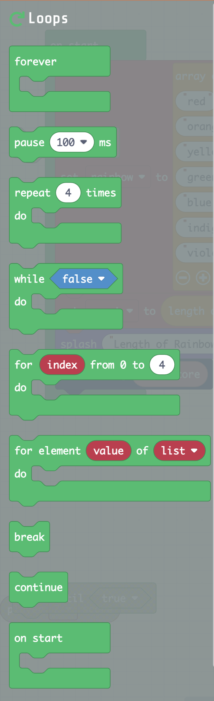

# Loops Folder 

For more information and examples, go to
<https://arcade.makecode.com/blocks/loops>

## Loop Forever block

Run a part of the program in the background and keep running it over
again.

The code you have in a forever loop will run and keep repeating itself
the whole time your program is active. Code in other parts of your
program won’t stop while your forever loop is running. This includes
other forever loops and the [run in
parallel](https://arcade.makecode.com/reference/control/run-in-parallel) block.

-   For more information and examples, go to
    <https://arcade.makecode.com/reference/loops/forever>

## Pause block

This block pauses a part of the program for the number of milliseconds
specified.

For more information and examples, go to
<https://arcade.makecode.com/reference/loops/pause>

## Loop Repeat times

This block runs part of the program the number of times you specify. In
the following example, the ***do*** code is run ***4*** times.

For more information and examples, go to
<https://arcade.makecode.com/blocks/loops/repeat>

## Loop While

This block repeats code while
a [<u>Boolean</u>](https://arcade.makecode.com/blocks/logic/boolean) condition is
true.

For more information and examples, go to
<https://arcade.makecode.com/blocks/loops/while>

## Loop For from to 

For more information and examples, go to
<https://makecode.microbit.org/blocks/loops/for>

For element of  
  
This block runs Run part of the program for each element in an array
list.

For more information and examples, go to
<https://arcade.makecode.com/blocks/loops/for-of>

## Break

Break out of the current loop and continue the program.

When a program encounters a break, the loop that contains it will stop
running at the place of the break. The program then continues by running
the code right after the end of the loop.

If a loop with a break is inside of another loop (nested loop), only the
loop with the break will end. The outer loop will continue to run the
code inside of it.

\- For more information and examples, go to
<https://makecode.microbit.org/blocks/loops/break>

## Continue 

This block skips the rest of the code in a loop and start the loop
again.

The following is an example using the ***Continue*** block.

-   For more information and examples, go to
    <https://makecode.microbit.org/blocks/loops/continue>

## On Start block

An event that runs when the program starts.

The on start is a special event that runs when the program starts,
before any other event. Use this event to initialize your program.

The on start block is in the Loops folder and looks like the following  

-   For more information and examples, go to
    <https://arcade.makecode.com/blocks/on-start>