# Math Folder

The Math blocks are used for
[numbers](https://arcade.makecode.com/types/number), number operators,
and math functions.

-   For more information and examples on the Math blocks, go to
    <https://arcade.makecode.com/reference/math>

## Numeric values: 0, 1, 2, 6.7, 10.083…

Just numbers by themselves. Sometimes these are called *numeric
literals*.

## Integers: whole numbers

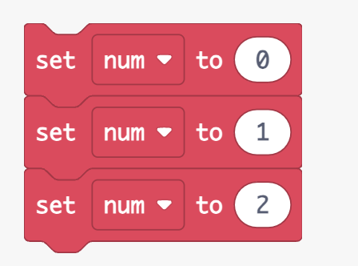

## Floating point: numbers with a fractional part

Numbers can have their fractional part too. The decimal point is between
the digits of the number. But, *floating point* numbers have the decimal
point at any spot between digits, like: 3.14159 or 651.75.

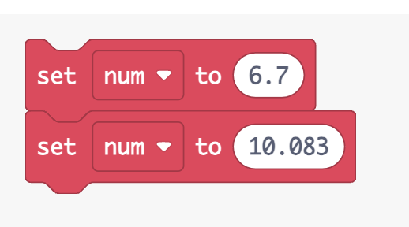

## Arithmetic binary operation (+, -, \*, /)

The operations for basic arithmetic: add, subtract, multiply, and
divide.

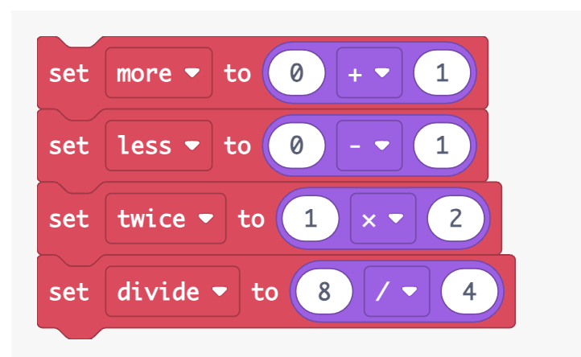

## Remainder (%)

This is a extra operator for division. You can find out how much is left
over if one number doesn’t divide into the other number evenly.

We know that 4 / 2 = 2, so 2 divides into 4 evenly. But, 5 / 2 = 2 with
a remainder of 1. So, the remainder operation, 5 % 2 = 1, gives the
number that’s left over from a division operation.

## Exponent (\*\*)

The exponent operator will multiply the number on the left by itself for
the amount of times of the number on its right. That is, 4 \*\* 2 = 4 \*
4 and 2 \*\* 3 = 2 \* 2 \* 2. The area of a square that has sides with a
length of 5 is equal to one side multiplied by another. For a square,
all sides are equal, so:

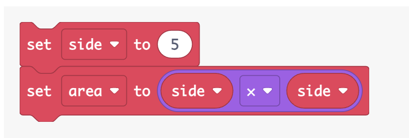

But using the exponent operator, this is the same as:

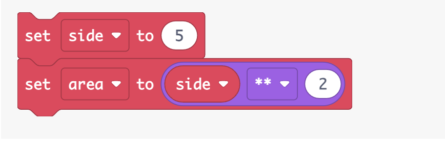
The volume of a cube is three sides multiplied together. The two volumes
are the same:

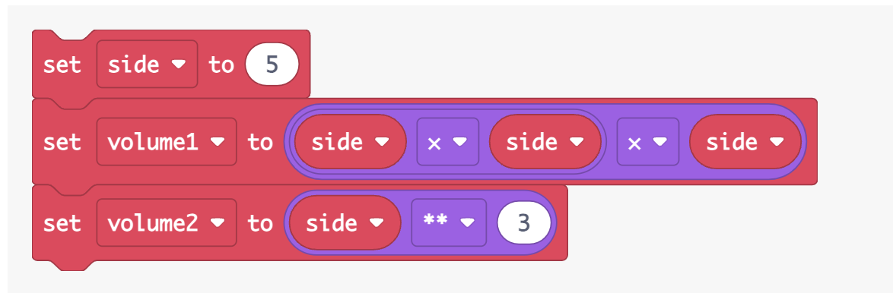

## Integer multiply and divide

Integer multiply and divide treats the two numbers it operates on as
integers. If there is a fractional part for a number, it is truncated
before it is used with the other number. The resulting value is always
an integer too.

## Imul – Integer Multiplication

Integer multiplication of two numbers 3.9 and 4.2 results in a value
of 12 since just the values of 3 and 4 are used from the numbers
multiplied.

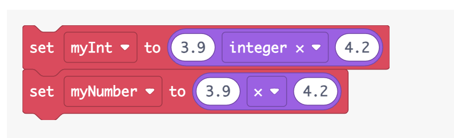

##  idiv – Integer Division

Integer division of two numbers 7.8 and 2.6 results in a value
of 3 since just the values of 7 and 2 are used from the numbers
multiplied.

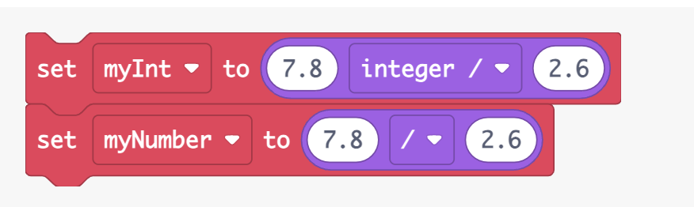

## Square root

The square root of a number is another number that when multiplied by
itself it becomes the original number. You know that 2 \* 2 equals 4 so
the square root of 4 is 2. It’s called a *square root* because the area
of a *square* is the length of two equal sides multiplied together.
The *root* is the length of a side.

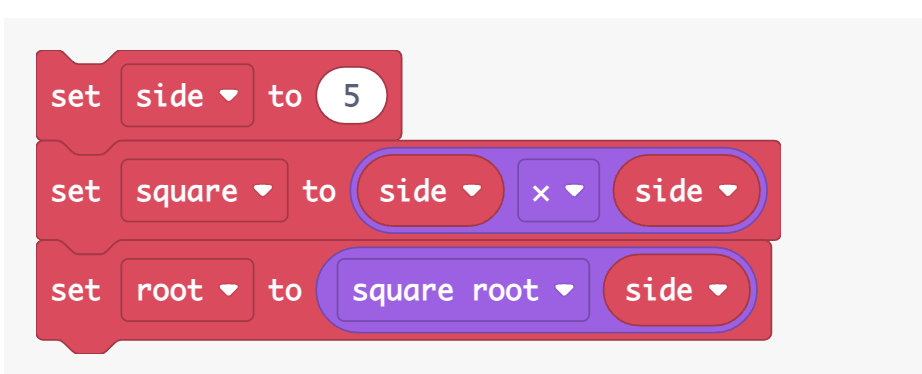

## Absolute value

When you want to know how much a number is without its *sign* (+/-). The
absolute value of -5 is 5 and the absolute value of 5 is also 5. The
absolute value is sometimes called the *magnitude*.

-   For more information on absolute block, go to
    <https://arcade.makecode.com/reference/math/min>

##  Minimum and maximum of two values

You can get the smaller or the bigger of two numbers with
the [min](https://arcade.makecode.com/reference/math/min) and [max](https://arcade.makecode.com/reference/math/max) functions.

-   The minimum of 2 and 9: **Math.min(2, 9)** equals 2.

-   The maximum of 3 and 9: **Math.max(3, 9)** equals 9.

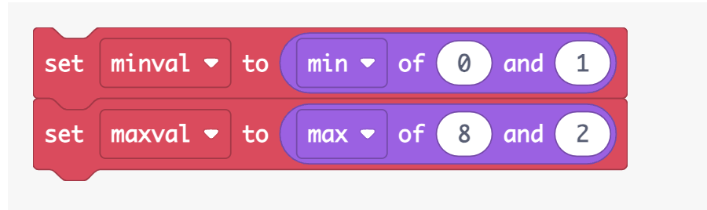

## For more information on max block, go to <https://arcade.makecode.com/reference/math/max>

-   For more information on min block, go
    <https://arcade.makecode.com/reference/math/min>

## Round

If a number has a fractional part, you can make the number change to be
the closest, next integer value. This is called *rounding*. Rounding the
number 6.78 will make it be 7 and rounding 9.3 will give you 9. If a
number has a fractional part greater than or equal to 0.5, the number
will round up to the next whole integer value with the higher value.
Otherwise, it will round down to the next lowest integer value.

For negative numbers, they round toward the absolute value (the absolute
value of -8 is 8) of the number. So, -5.23 rounds to -5 and -2.68 rounds
to -3.

##  Ceiling

To make a number change to the next higher whole number (integer), get
the number’s *ceiling* value. The ceiling value for 1.234 is 2 since
that is the next higher whole number. For the negative number of -3.63,
its ceiling is -3 since that’s the next higher whole number.

## Floor

To make a number change to the next lower whole number (integer), get
the number’s *floor* value. The floor value for 8.76 is 8 since that is
the next lower whole number. For the negative number of 6.17, its floor
is -7 since that’s the next lower whole number.

## Truncate

The fractional part of a number is removed by *truncating* it. If a
number has the value 54.234 its truncated value is 54. Truncation works
the same way for a negative number. The truncated value
of -34.913 is -34.

## 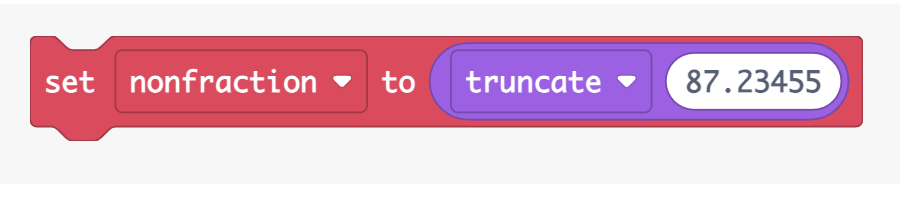 Random value

Make up any number from a minimum value to a some maximum value. If you
want a random number up to 100, say: **Math.randomRange(0, 100)**.

