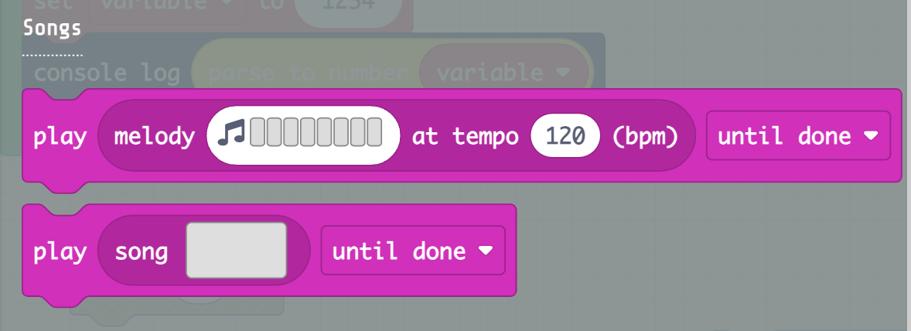
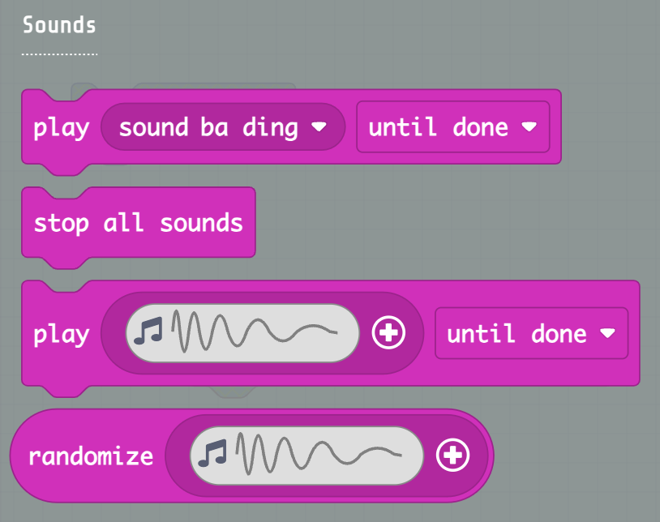
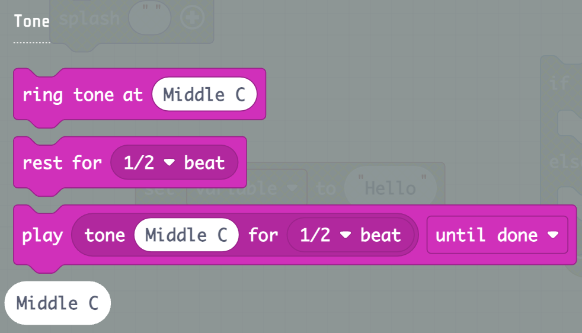
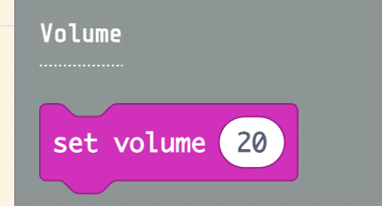
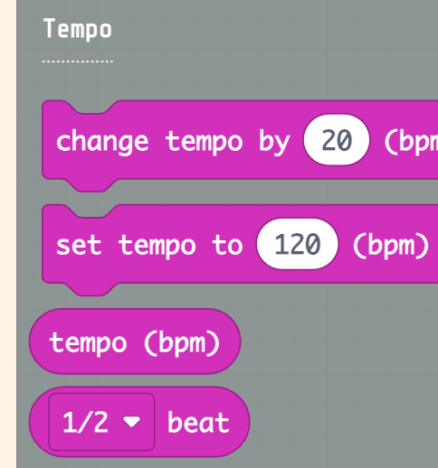

# Music Folder

-   For more information and examples on Music blocks, go to
    <https://arcade.makecode.com/reference/music>  
    Songs   
      
      
    *Sounds*

\*\* Needs more work \*\*

###   Tone

\*\* Needs more work \*\*

## Volume

\*\* Needs more work \*\*

## Tempo

\*\* Needs more work \*\*