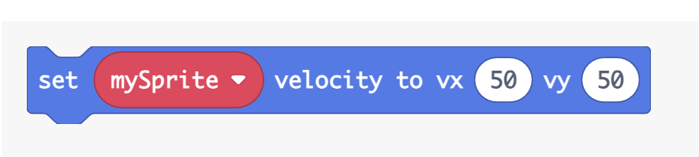

# Sprites Folder 

The Sprites folder provides block to create and move game objects.  
It also has blocks to handle overlaps between sprites.

For more information and examples on the creating and moving sprites, go
to <https://arcade.makecode.com/reference/sprites>

For an introduction to Sprites, see the videos and the activity at

<https://arcade.makecode.com/courses/csintro1/intro/sprites>

## Create Sprites 

The following blocks are used to create a sprite image as well as
categorize what type of sprite it is.

>  style="width:5.66238in;height:2.56444in"
> alt="A screenshot of a video game Description automatically generated" />

The default types/kinds of sprite in Make Code Arcade are:

-   Player

-   Enemy

-   Food

You can also create more types of kinds of Sprites.

-   For more information and examples, go to
    <https://arcade.makecode.com/reference/sprites/create>

## Sprite Physics Blocks

The Sprite Physics blocks are used to move the Sprite on the screen.

-   For information and examples, go to
    <https://arcade.makecode.com/reference/sprites>

### Set Sprite Velocity/Speed

This block sets the speed of the Sprite on the horizontal and vertical
axis.

-   **vx**: the new horizontal (up and down) velocity (speed) for the
    sprite.

-   **vy**: the new vertical (left and right) velocity (speed) for the
    sprite.

<!-- -->

-   For more information on what is a variable, go to
    <https://arcade.makecode.com/reference/sprites/sprite/set-velocity>

-   Need a refresher on vertical and horizontal, check out

    -   <https://www.splashlearn.com/math-vocabulary/geometry/horizontal>

    -   <https://www.hmhco.com/blog/teaching-x-and-y-axis-graph-on-coordinate-grids#:~:text=A%20coordinate%20grid%20has%20two,intersect%20is%20called%20the%20origin>.

### Set Sprite Position

This block places the Sprite on the screen at specific vertical and
horizontal position on the screen

-   For more information and examples, go to

<https://arcade.makecode.com/reference/sprites/sprite/set-position>

### Set Sprite X position Block

This block changes the X (or Y) position of the sprite on the screen
with a specific X or Y value.

>  style="width:4.50844in;height:0.60079in"
> alt="A red and blue button with white text Description automatically generated" />

-   For more information and examples, go to  
    <https://arcade.makecode.com/reference/sprites/sprite/x>

<https://arcade.makecode.com/reference/sprites/sprite/y>

### Change Sprite X or Y position block

This block changes the X (or Y) position of the sprite on the screen
with adding the by variable to the current Sprite position.

-   For more information and examples, go to  
    <https://arcade.makecode.com/reference/sprites/sprite/x>

<https://arcade.makecode.com/reference/sprites/sprite/y>

### Follow Sprite Block

The Follow Sprite block sets a Sprite to move to the position of another
Sprite.

-   For more information and examples, go to
    <https://arcade.makecode.com/reference/sprites/sprite/follow>

## Sprite Effects Blocks

The following blocks provide effects for a Sprite like bouncing on a
wall.

>  style="width:5.84313in;height:3.71918in"
> alt="A screenshot of a game Description automatically generated" />

### Start Effect Block

>  style="width:5.76389in;height:1.01389in"
> alt="A blue rectangle with white text Description automatically generated" />

-   For more information on what is a variable, go to
    <https://arcade.makecode.com/reference/sprites/sprite/start-effect>

### Clear Effect Block

>  style="width:4.38889in;height:0.93056in"
> alt="A blue rectangle with white text Description automatically generated" />

-   For more information on what is a variable, go to
    <https://arcade.makecode.com/reference/effects/clear-particles>

### Destroy Sprite 

>  style="width:3.63889in;height:1.31944in"
> alt="A red and blue rectangle with white text Description automatically generated" />

-   For more information on what is a variable, go to
    <https://arcade.makecode.com/reference/sprites/sprite/destroy>

### Destroy Sprite Kind

This block destroys all players of a certain kind.

>  style="width:5.84722in;height:1.20833in"
> alt="A blue rectangle with white text Description automatically generated" />

-   For more information on what is a variable, go to
    <https://arcade.makecode.com/reference/sprites/destroy-all-sprites-of-kind>

### Sprite Say Block

This block displays near the sprite what ever is entered in the say
variable.

>  style="width:4.38889in;height:1.04167in"
> alt="A red and blue button with white text Description automatically generated" />

-   For more information and examples, go to
    <https://arcade.makecode.com/reference/sprites/sprite/say>

### Sprite Stay on Screen

The sprite is forced to stay on the screen when it reaches the screen
edge

-   For more information and examples, go to
    <https://arcade.makecode.com/reference/sprites/sprite/set-flag>

### Sprite Bounce on wall

-   For more information and examples, go to
    <https://arcade.makecode.com/reference/sprites/sprite/set-flag>

### Sprite auto destroy

Sprites with the auto destroy flag on are destroyed when the sprite’s
image moves past the edge of the screen.

>  style="width:6.29167in;height:1.29167in"
> alt="A blue rectangle with white text Description automatically generated" />

-   For more information and examples, go to
    <https://arcade.makecode.com/reference/sprites/sprite/set-flag>

## Sprite Projectile Blocks

Projectiles are regular sprites that destroy itself when they go off the
visible screen.

For more information and examples, go to :

-   [Activity: Projectile
    Sprites](https://arcade.makecode.com/courses/csintro1/loops/projectiles#:~:text=Projectiles%20are%20regular%20sprites%20that,that%20floats%20across%20the%20screen).

-   <https://arcade.makecode.com/courses/csintro1/loops/projectile-from>

-   <https://arcade.makecode.com/courses/csintro3/structure/projectiles>
    (with Python/Javascript examples)

-   Video on Projectiles

    -   [Makecode Arcade Tutorial 6: Creating
        projectiles](https://www.youtube.com/watch?v=_CeoT07WfZA)

### Projectile from sprite block

-   For more information and examples, go to
    <https://arcade.makecode.com/reference/sprites/create-projectile-from-sprite>

### Projectile from side block

-   For more information and examples, go to
    <https://arcade.makecode.com/reference/sprites/create-projectile-from-side>

## Sprite Lifecycle Blocks

Lifecycle blocks are used to create or destroy a Sprite in a game.

### On Sprite Created Block

This block is used to perform some action/code, once a sprite is
created.

>  style="width:5.382in;height:0.96317in"
> alt="A blue and white text box Description automatically generated" />

-   For more information and examples, go to
    <https://arcade.makecode.com/reference/sprites/on-created>

### On Sprite Destroyed 

This block is used to run code in the block section when a sprite of a
certain kind is destroyed.

>  style="width:5.57161in;height:0.93431in"
> alt="A blue and white rectangular box with white text Description automatically generated" />

-   For more information and examples, go to
    <https://arcade.makecode.com/reference/sprites/on-destroyed>

### Blocks for an Array of Sprites

An array of Sprite is a collection of multiple sprites of the same kind.

-   For more information and examples, go to
    <https://arcade.makecode.com/courses/csintro2/arrays/sprites>

## Sprite Image Blocks

These blocks are used to create an image for a Sprite.

Change the current image to another Sprite’s image.  
In this example the “mySprite” image is copied to “currentImage

-   For more information and examples, go to
    <https://arcade.makecode.com/reference/sprites/sprite/image>

##  

## Sprite Scale Blocks

The Sprite Scale blocks are used to change the size of a Sprite.

### Set Sprite Scale Block

You can increase or decrease a sprite from it’s current size to a new
size by setting a scale value.

The **anchor** determines which direction the sprite will expand or
shrink.

>  style="width:6.53566in;height:0.81251in"
> alt="A blue and white rectangular box with white text Description automatically generated" />

-   For more information and examples, go to
    <https://arcade.makecode.com/reference/sprites/sprite/set-scale>

### Change Sprite Anchor Block

This block can increase the Sprite size by the scale number provided.

>  style="width:6.54643in;height:0.76299in"
> alt="A blue and white rectangular sign with white text Description automatically generated" />

The anchor variable is the point to change the size of the Sprite.  
The Anchor options include: middle, top, left, right, bottom.

-   For more information and examples, go to
    <https://arcade.makecode.com/reference/sprites/sprite/change-scale>
