# Text Folder 

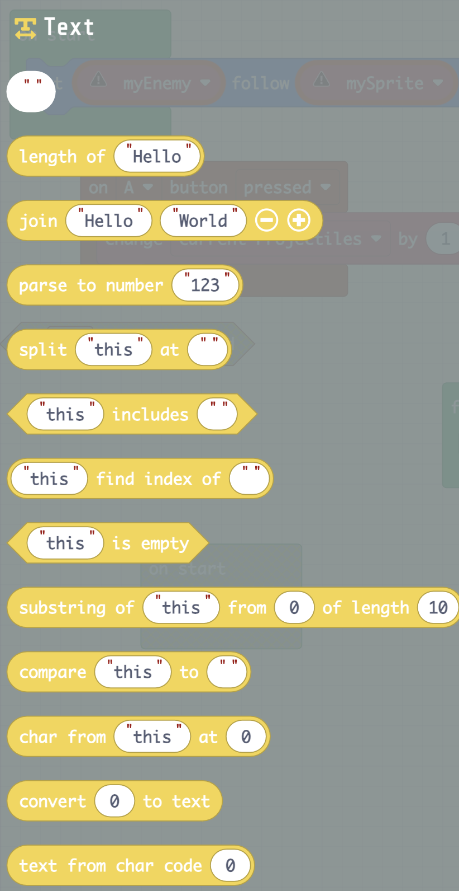

### Length of Block

The block returns the size of a text/character variable or string.

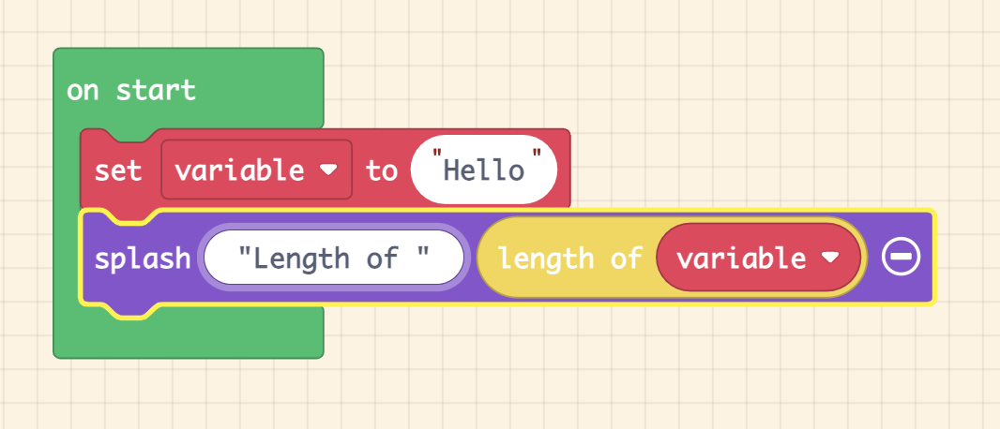

-   For the example above, go
    <https://arcade.makecode.com/S27034-94077-27232-76778>

-   For more information and examples, go to
    <https://arcade.makecode.com/reference/text/length>

## Join Block

The join block adds (also known as
[concatenate](https://www.merriam-webster.com/dictionary/concatenate))
one or more strings together. The example below, adds one text string to
another to make one bigger string.

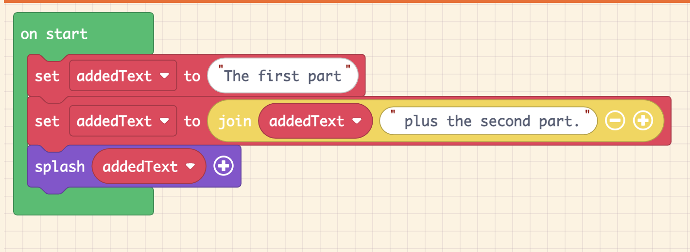

-   For the example above, go to
    <https://arcade.makecode.com/S12361-70603-25850-09653>

-   For more information or examples go to
    <https://arcade.makecode.com/reference/text/join>

## Parse to number block

This block changes the numeric characters into a floating point number
value.

The text or variable must only have numbers or it will fail.

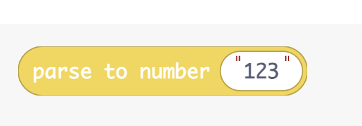  
  
Example:  
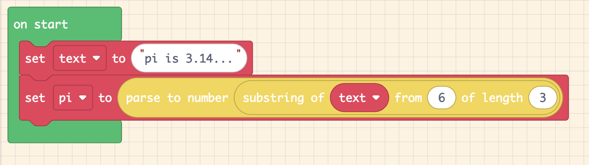

-   For more information and examples, go to
    <https://arcade.makecode.com/reference/text/parse-float>

## Split block

This block splits a string into smaller strings using a separator string
to divide the larger string,

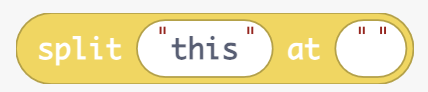

-   For more information and examples, go to
    <https://arcade.makecode.com/reference/text/split>

Include block  
The include block returns a **True** if the Array has the ***includes***
data. It return **False**, if the includes data is not in **Array**.  
The following example shows the use of include block.

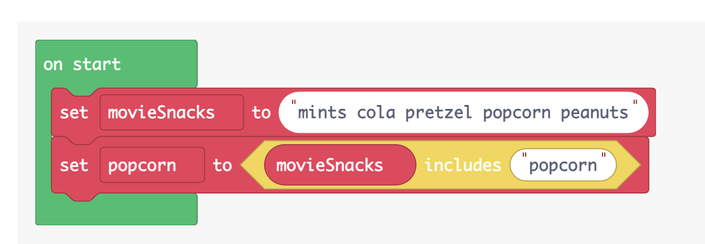

-   For more information and examples, go to
    <https://arcade.makecode.com/reference/text/includes>

## Find index Block

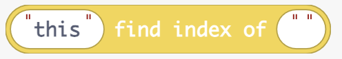

The following is an example of using the find index block.

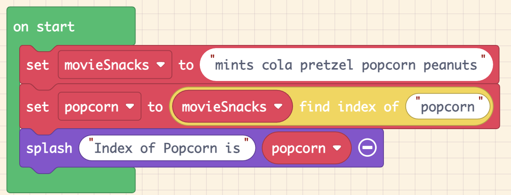

\- <https://arcade.makecode.com/S69633-79892-01337-15025>

-   For more information and examples, go to
    <https://arcade.makecode.com/reference/text/index-of>

## Is empty Block

The example shows a way to use the is empty block with an **IF** block

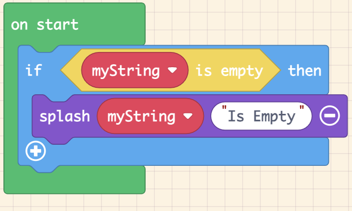

-   For more information and examples, go to
    <https://arcade.makecode.com/reference/text/is-empty>

## Substring Block (Substr) 

This block takes some part of the **this** string to make a smaller
string (substring) given the positions defined in the **from** and
**length** parameters.

-   For more information and examples, go to
    <https://arcade.makecode.com/reference/text/substr>

## Compare Block

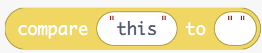

-   For more information and examples, go to
    <https://arcade.makecode.com/reference/text/compare>

## Convert to Text Block

This block changes the value/variable
[type](https://arcade.makecode.com/types) into a
text [string](https://arcade.makecode.com/types/string).

-   For more information and examples, go to
    <https://arcade.makecode.com/reference/text/convert-to-text>