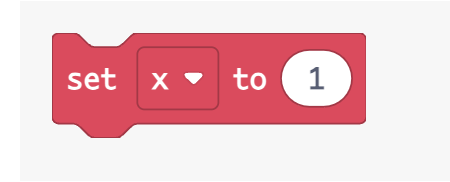
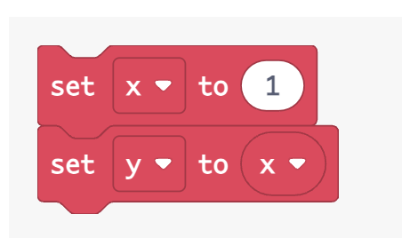
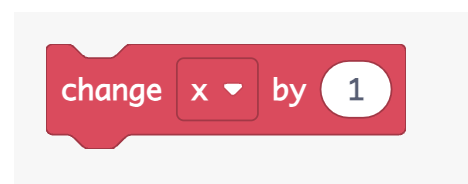

# Variables Folder

## What is a variable?

In programming, a variable is a container that has a value. The value of
a variable that can change depending on conditions or other information
the provided to the program.

<https://arcade.makecode.com/types/number>

<https://arcade.makecode.com/types/string>

## Assign/Set Block

The **set** block assigns or changes the variable’s value.

You can also use the set block to assign a ***variable*** to another
***variable***.

## Change Block

The change block adds a number specified in the ***by*** variable.

v

-   For more information on what is a variable, go to
    <https://makecode.microbit.org/lessons/variables>

-   For more information, go to
    <https://arcade.makecode.com/blocks/variables>
